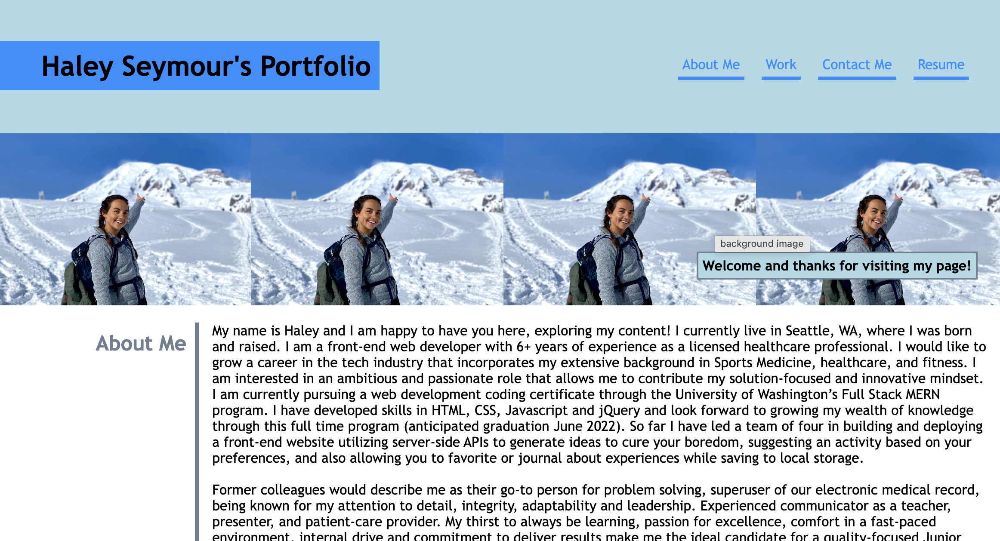
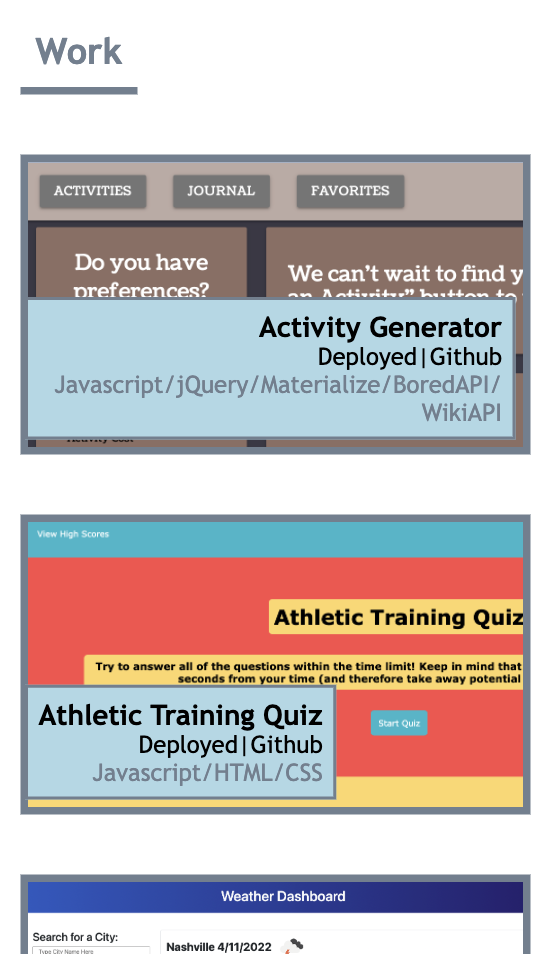
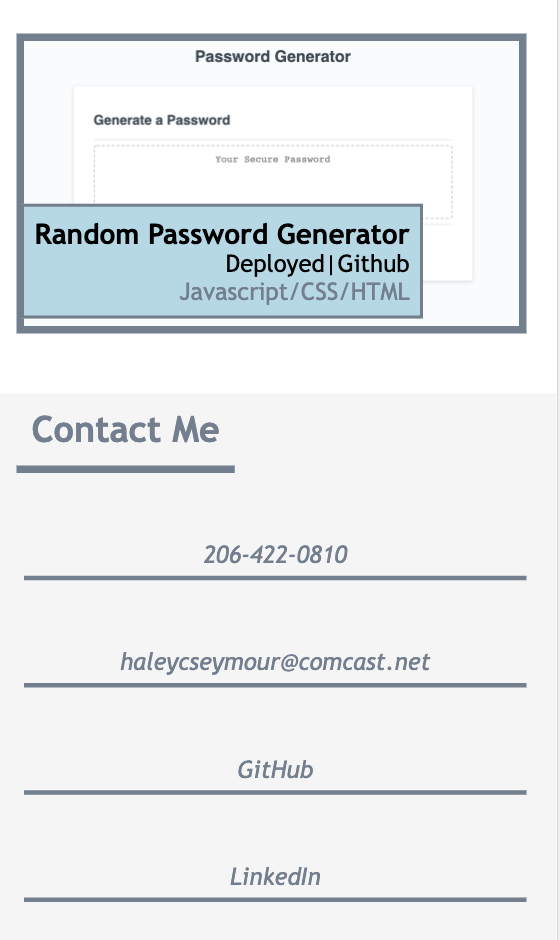

# Haley Seymour's Porfolio Project
LICENSE: [GNU Public License](https://github.com/hseymo/haleysportfolio/blob/main/LICENSE)

INSTALLATION: Fork this repository and clone it to your local source using git clone commands.

PACKAGES: None

DESCRIPTION: 
This is project to build a portfolio page. The intent of this project is to showcase my other projects in a clear and concise page for potential employers to view during the hiring process. HTML and CSS are the two languages used on this page. The build for this page focuses on employing flexbox, media queries and CSS pseuoclasses. 

Please check out this project by clicking [here](https://hseymo.github.io/haleysportfolio/).

APPLICATION:
Desktop version: 

Tablet version:

Phone/small screen version:

ACKNOWLEDGMENTS: Thank you to UW Web Development Bootcamp for providing the overall concept of layout for this project. 

QUESTIONS:
If you have any questions, please contact me on GitHub at [hseymo](https://github.com/hseymo) or by [email](mailto:fake@gmail.com).
